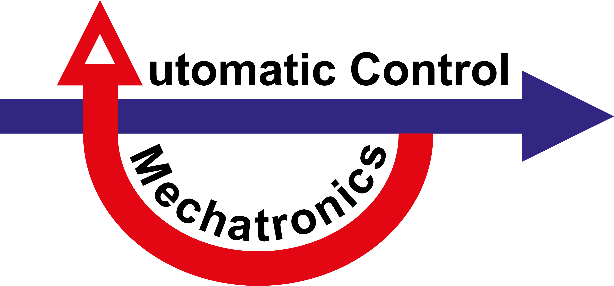

# MRT Siegen
Here you find code to current research projects of the research group **Automatic Control - Mechatronics** under the direction of the Prof. Dr.-Ing. Oliver Nelles. 

### Research Topics (Excerpt):
- Design of Experiments
   - Preprocessing for Data-Driven Modeling with Probability Density Estimation
   - Density-Based Data Weighting
   - Growing DoE with 1- and 2-Class Classifiers
- Nonlinear Dynamic Modeling
   - Nonlinear Regularized FIR Models
   - Nonlinear Laguerre and Kautz Models
   - Nonlinear State Space Identification
   - Gray-Box State Space Modeling

## Contact Information
Find out more about current research and contact information [on our Website](https://www.mb.uni-siegen.de/mrt/index.html.en?lang=en).
