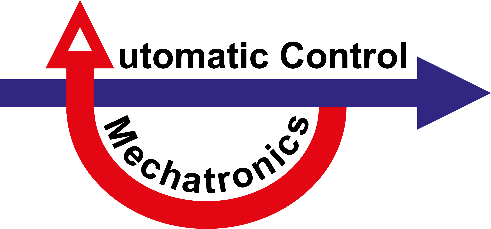

# MRT Siegen

This repository contains code related to current research projects of the research group Automatic Control – Mechatronics, led by Prof. Dr.-Ing. Oliver Nelles.

## Research Topics (Selection):
- Design of Experiments
   - Preprocessing for Data-Driven Modeling with Probability Density Estimation
   - Density-Based Data Weighting
   - Growing DoE with 1- and 2-Class Classifiers
- Nonlinear Dynamic Modeling
   - Nonlinear Regularized FIR Models
   - Nonlinear Laguerre and Kautz Models
   - Nonlinear State Space Identification
   - Gray-Box State Space Modeling

## Literature 
[[1]]( https://doi.org/10.1007/978-3-030-47439-3) Nelles, Oliver. 2020. Nonlinear System Identification: From Classical Approaches to Neural Networks, Fuzzy Models, and Gaussian Processes. Springer International Publishing.

## Contact Information

Further information about current research projects and contact details can be found on our website.